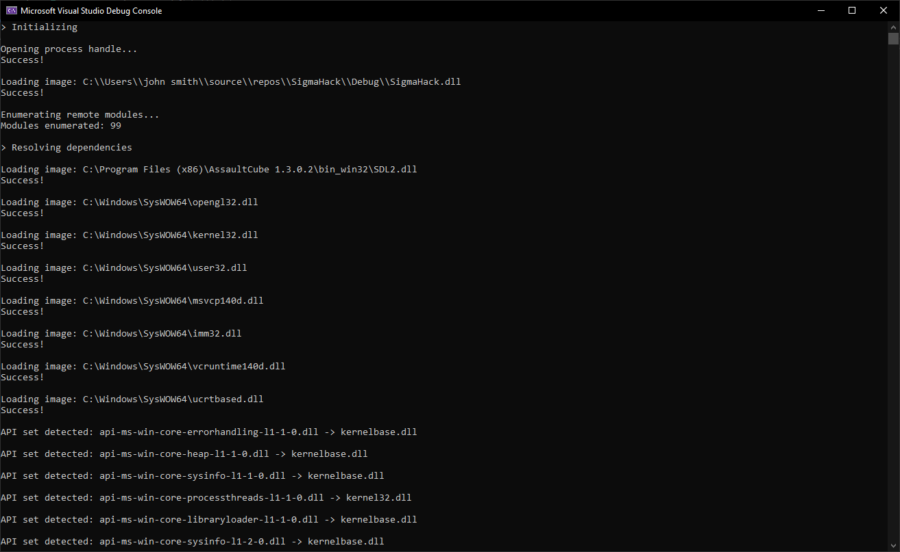
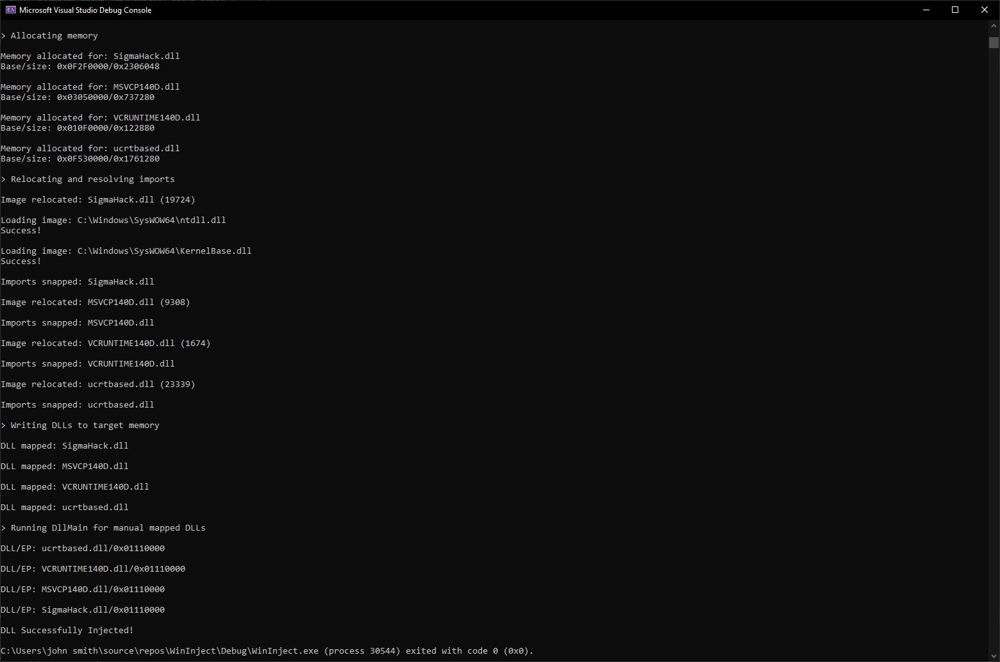

# WinInject

- A 32 bit Windows 10 DLL injector, focused on manual map injection. Manual mapping logic is based on that of the Windows image loader.  
- Multiple assumptions regarding the injected DLLs are made. [WinLoad](https://github.com/islipnot/WinLoad), another project of mine, is a much more accurate and detailed representation of the image loader.
- Manual mapping logic is based on my findings when reversing the image loader.

## Usage

- Argument format: &lt;TargetProcess&gt; &lt;DllPath&gt; &lt;Flags&gt;
- TargetProcess must end in .exe
- DllPath must end in .dll

### Flags
- "ManualMap": Manually maps the target DLL and its dependencies.
- "LoadLibrary": Uses LoadLibraryW to inject the target DLL.

## Features

- Capable of LoadLibraryW and manual map injections.
- Resolves and maps all unloaded dependencies.
- Efficient resolution and handling of API sets and forwarders.
- TLS handled if a .tls section is detected.

## Todo

- Improve TLS handling - if the injected dll hooks the main loop, there is currently undefined behavior on TLS access from the hook(s).
- Add ordinal import support.
- Optimize existing code.
- Create a GUI build.
- Add x64 support.

## Screenshots

